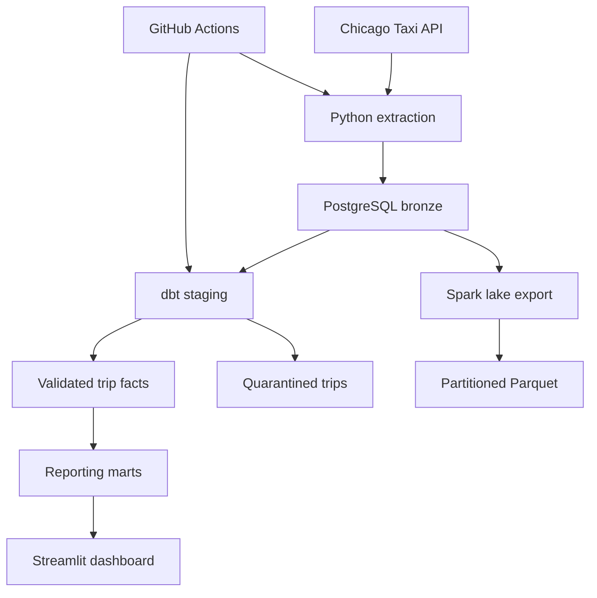

# Chicago Taxi Analytics: API to Dashboard

A complete data engineering portfolio project: extract paginated taxi trip data from a public API, load raw JSON into PostgreSQL, transform with dbt, and serve revenue and demand reports through Streamlit.

**Stack:** Python · Socrata API · PostgreSQL · dbt · Streamlit · Docker · GitHub Actions · optional Apache Spark/Parquet.

## Architecture



## Business questions

- How do reported trip totals and trip counts change by day?
- Which hours have the highest demand?
- How do payment methods compare?
- What are average trip value, distance and duration?

Amounts are USD. `trip_total` is the source-reported total, including components beyond fare; it is not a statement of taxi-company net revenue. Source timestamps represent Chicago local time, rounded by the provider. Missing tips remain missing rather than being treated as zero.

## Quick start: complete stack

Install Docker Desktop with Compose. From the repository root:

```bash
cp .env.example .env
# Set a local PostgreSQL password. Use URL-safe characters for this example configuration.
docker compose up -d postgres
docker compose build
make sample
docker compose up -d dashboard
```

Open http://localhost:8501. The sample contains **120 synthetic valid trips** and one invalid trip, clearly identified as sample data in this README. For a real API load:

```bash
# .env defaults to a one-day historical window; adjust START_DATE / END_DATE.
make run
```

Dates use an inclusive start and exclusive end. The default API dataset is `ajtu-isnz` (2024 onward). Use `DATASET_ID=wrvz-psew` for 2013–2023 dates. There is no paid API requirement; an optional Socrata application token improves rate-limit handling.

The Docker dashboard reflects whichever data you loaded. Fixture runs are synthetic; use an API run before presenting results as real Chicago trip metrics. The standalone demo explicitly labels its data synthetic.

## Lightweight demo without Docker

```bash
python scripts/demo.py
python -m pip install '.[dashboard]'
DEMO_DB=data/demo.db streamlit run dashboard/app.py
```

The dependency-free demo builds SQLite reporting tables from the synthetic fixture. It demonstrates reporting only; PostgreSQL/dbt remain the full pipeline path. On Windows PowerShell, set `$env:DEMO_DB='data/demo.db'` before running Streamlit. Run Docker commands directly if `make` is unavailable.

## Automated daily ETL

`.github/workflows/daily.yml` runs at 06:30 UTC when repository variable `ENABLE_DAILY_PIPELINE=true`. It needs a persistent PostgreSQL database reachable from the runner. The database created by local Compose is **not** that hosted database.

Configure these GitHub Actions secrets:

| Secret | Purpose |
|---|---|
| `DATABASE_URL` | psycopg connection URL; include `sslmode=require` for a hosted database |
| `DB_HOST` | Database hostname for dbt |
| `POSTGRES_USER` | Database user |
| `POSTGRES_PASSWORD` | Database password |
| `POSTGRES_DB` | Database name |
| `SOCRATA_APP_TOKEN` | Optional source token |

Without supplied dates, the scheduled job reloads the last seven days. Source publishing can lag longer, so adjust the lookback or trigger a historical backfill as needed. GitHub schedules are best-effort and may be delayed. Every successful ingestion is followed by `dbt build`, including data tests. Actions reports job failures; ingestion audit records separately track extraction status.

## Engineering decisions

- **Keyset pagination:** ordered trip IDs avoid increasingly expensive offsets; each API request remains bounded to 5,000 rows.
- **Raw data retention:** JSONB retains the original source fields before modelling.
- **Replay-safe load:** trip IDs are primary keys. Changed payloads update existing rows; unchanged replays do not rewrite them.
- **Retries:** five attempts for rate limits and transient failures; other HTTP errors fail immediately.
- **Writer lock:** PostgreSQL advisory lock prevents overlapping ingestion runs.
- **Partial failures:** completed batches remain loaded and can be replayed safely. dbt does not run after extraction failure in the workflow.
- **Audit records:** start/end dates, extracted row counts, completion status and errors.
- **Quality:** invalid or missing required numeric values enter a quarantine table. dbt tests uniqueness, completeness and source-to-fact reconciliation.
- **Separation:** dashboard queries aggregate marts, avoiding raw JSON processing for each page view.

Source rows can change during pagination; the API does not supply snapshot isolation. The lookback mitigates missed corrections but does not guarantee capture of old updates or deleted records. Raw load transactions commit per batch. dbt builds models separately, so the current implementation does not provide an atomic publication of all reporting tables.

## Big data path and practical limits

The source contains many years of taxi trips; start with a day before expanding historical windows. The API loader uses bounded batches rather than loading the entire response history into memory. This is **not a claim that this local setup has been benchmarked at billion-row scale**.

`scripts/spark_lake.py` exports bronze data using parallel JDBC reads and writes Parquet partitioned by date. To run it, install Java 17 and `pip install '.[spark]'`, obtain the PostgreSQL JDBC driver, and set `JDBC_URL` (such as `jdbc:postgresql://localhost:5432/taxi`), `POSTGRES_USER`, `POSTGRES_PASSWORD` and optionally `LAKE_PATH`:

```bash
spark-submit --jars /path/to/postgresql.jar scripts/spark_lake.py
```

The database must be reachable from Spark. Local Compose intentionally does not expose the database port; run Spark on the same network or configure a localhost-only port binding. Spark defaults to local execution unless a cluster master is provided. The export overwrites its destination and is an optional lake extension; dashboard transformations run in PostgreSQL with dbt.

The first version rebuilds dbt tables in full. For sustained large-scale operation, move historical raw storage to object storage, use incremental partition-aware models, add indexes after measuring plans, and separate ingestion and analytics compute. Late-arriving corrections need explicit partition reprocessing. Backfill one date window at a time; do not mistake a demo run for a performance benchmark.

## Tests and validation

```bash
make test
```

CI provisions PostgreSQL, loads the fixture twice, runs dbt models and tests, then asserts 121 raw IDs, 120 valid facts, one rejected trip and two successful run records. This verifies replay behaviour and quarantine alongside API pagination unit tests.

During initial generation, five unit tests, dbt project parsing and the SQLite demo were run successfully: 120 valid trips and $2,452 in synthetic totals. Docker, live API ingestion, PostgreSQL/dbt integration and Spark execution were not available in the generation environment; the CI integration workflow is supplied to validate those database paths after upload. Spark is not covered by CI.

## Repository layout

```text
src/taxi_pipeline/      API extraction and PostgreSQL loader
 dbt/                  SQL transformations and quality tests
 dashboard/            Streamlit reports
 scripts/              Offline demo and optional Spark export
 data/sample/          Clearly synthetic fixture
 tests/                Pagination and database assertions
 .github/workflows/    CI and scheduled ingestion
 compose.yml           Local PostgreSQL and dashboard stack
```

## Publish to GitHub

Create an empty repository named `chicago-taxi-analytics`, then run:

```bash
git init -b main
git add .
git commit -m "Build API-to-dashboard taxi analytics pipeline"
git remote add origin https://github.com/YOUR_USERNAME/chicago-taxi-analytics.git
git push -u origin main
```

Never commit `.env` or credentials. Enable CI and verify its first run before describing this as fully tested. Suggested topics: `data-engineering`, `etl`, `postgresql`, `dbt`, `streamlit`, `pyspark`, `github-actions`.

## Source documentation

- [Chicago Taxi Trips (2024 onward)](https://catalog.data.gov/dataset/taxi-trips-2024)
- [Chicago Taxi Trips (2013–2023)](https://catalog.data.gov/dataset/taxi-trips-2013-2023)
- [Socrata paging guidance](https://dev.socrata.com/docs/paging.html)
- [Spark JDBC](https://spark.apache.org/docs/3.5.6/sql-data-sources-jdbc.html)

The software is MIT licensed. Source data remains subject to its provider's terms and privacy transformations. Synthetic sample IDs do not represent real trips.
